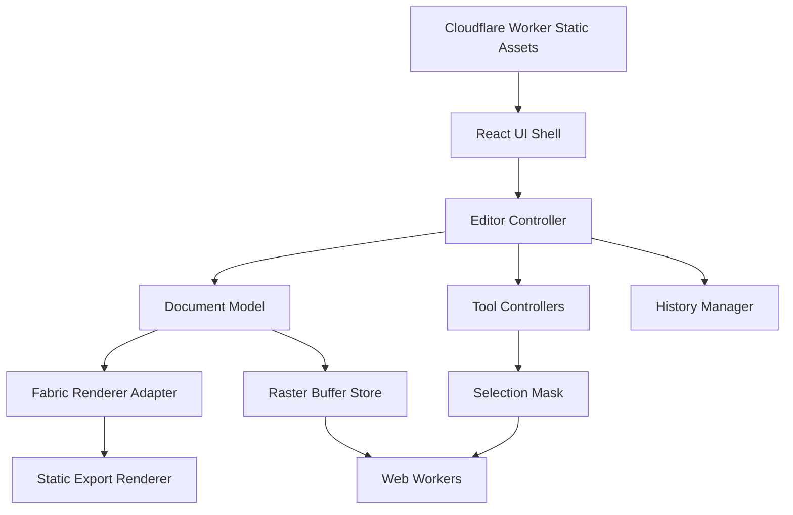

# LiteEdit v1 Build Plan

Status: planning baseline  
Target: `https://liteedit.charliepolito.com`  
Repository: `cpolito17/LiteEdit`  
Deployment: Cloudflare Workers Static Assets  
Primary audience: an expert junior developer working through small reviewed pull requests

## 1. Product goal

Build a fast, desktop-first photo editor that runs entirely in the browser. LiteEdit must support the required editing workflow without uploading the user's images to a server. Cloudflare serves the application files. All image decoding, editing, history, and export run on the user's device.

The product should feel like a precise creative workspace with a calm technical character. It should not imitate Photoshop's full surface area. Each tool must have a narrow, predictable contract and good defaults.

### v1 success condition

A user can open a PNG or JPEG, combine raster and vector layers, select and modify image regions, paint, erase, transform, crop, resize, undo operations, and export a correct PNG or JPEG. The editor remains responsive on a normal modern desktop with a 4096 x 4096 document.

### Expected effort

This is not a small canvas demo. Warp, raster selections, brush history, and object selection are the main risks. A realistic estimate for one strong junior developer with frequent expert review is 8-14 full-time engineer-weeks. Do not promise a date until the Phase 1 technical spikes pass.

## 2. Decisions and assumptions

| Decision          | v1 choice                                              | Reason                                                                                                                  |
| ----------------- | ------------------------------------------------------ | ----------------------------------------------------------------------------------------------------------------------- |
| Public URL        | `liteedit.charliepolito.com`                           | A Worker Custom Domain avoids path-prefix and routing conflicts with `charliepolito.com`.                               |
| Processing        | Local browser only                                     | Better privacy, lower operating cost, and no upload latency.                                                            |
| Backend storage   | None                                                   | v1 does not need KV, D1, R2, accounts, or server-side image processing.                                                 |
| UI archetype      | Tactical Telemetry & CRT Terminal                      | A dark editor shell fits image work and follows one visual mode consistently.                                           |
| App stack         | React, TypeScript, Vite                                | Mature tooling and clear component boundaries.                                                                          |
| Cloudflare stack  | Workers Static Assets with the Cloudflare Vite plugin  | It deploys the SPA as a Worker without an unnecessary API layer.                                                        |
| Interactive scene | Fabric.js behind an adapter                            | It provides object hit testing, grouping, transforms, vector shapes, viewport transforms, and serialization primitives. |
| Application state | Typed document model plus Zustand UI stores            | Fabric objects must not become the only source of truth.                                                                |
| Raster state      | Per-layer backing canvases outside React state         | Pixel buffers are too large and mutable for React or Zustand.                                                           |
| History           | Command transactions plus raster tile patches          | Full-document snapshots after every action will exhaust memory.                                                         |
| Object Selection  | Foreground extraction inside a user-drawn box or lasso | This is more useful than simple layer selection and can remain local. The engine is selected by a Phase 1 spike.        |
| Warp              | Destructive 3 x 3 mesh warp on raster layers           | It is testable and useful without building a full liquify system.                                                       |
| Mobile            | Not a v1 target                                        | The required editor needs desktop pointer and keyboard interaction.                                                     |

Important scope assumption: “Object Selection” means foreground extraction inside a region supplied by the user. It does not mean a full semantic model that identifies every object in a scene automatically. If automatic semantic segmentation is required, treat it as a separate lazy-loaded module and reapprove the bundle and performance budgets.

## 3. v1 scope

### Included

- Import PNG, JPEG, and browser-decodable WebP files.
- Create a blank document by width, height, and background.
- Raster layers, vector shape layers, and nested layer groups.
- Layer create, duplicate, rename, delete, show/hide, lock, group/ungroup, opacity, and ordering.
- Marquee, lasso, quick selection, and object selection.
- Add, subtract, intersect, invert, and clear selection masks.
- Move, scale, rotate, skew, and raster mesh warp.
- Brush with size, hardness, opacity, spacing, color, and optional pointer pressure.
- Rectangle, ellipse, triangle, polygon, star, line, and arrow shapes.
- Eraser using the same stamp engine as the brush.
- Free, fixed-aspect, and fixed-resolution crop.
- Undo, redo, and a visible history panel.
- Zoom, fit, 100%, pan, wheel navigation, and navigator status.
- Eyedropper, foreground/background colors, recent colors, and saved swatches.
- Document resize by pixel dimensions.
- JPEG target-file-size mode using a bounded quality search and optional downscale.
- PNG and JPEG export.
- Local crash recovery in IndexedDB after the editor model stabilizes.

### Explicitly excluded from v1

- Accounts, cloud documents, collaboration, comments, or sharing.
- PSD, TIFF, HEIC, RAW, or SVG project import.
- A native `.liteedit` project file unless added after core v1 is stable.
- Text layers, adjustment layers, layer masks, blend modes other than Normal, filters, clone stamp, healing, content-aware fill, liquify, and animation.
- Full color-management parity with professional desktop editors.
- CMYK editing or print-proof workflows.
- Mobile and tablet optimization.
- Server-side image processing.

Do not add excluded features during a required-feature pull request. Record them in an issue instead.

## 4. Feature contracts

These contracts prevent “Photoshop-like” labels from creating unbounded work.

### 4.1 Layers

- Every imported image creates one raster layer.
- A new paint layer is a transparent raster layer at document size.
- Every newly drawn shape creates one vector layer.
- A group can contain raster layers, vector layers, and other groups.
- The Layers panel shows the topmost rendered item first.
- Group opacity applies after children are composited. Do not multiply opacity into each child independently.
- Brush and eraser affect only the active, visible, unlocked raster layer.
- If the active layer is not raster, the paint tool creates a raster layer immediately above it and clearly reports that action.
- v1 uses only the Normal blend mode.

Acceptance examples:

1. Changing a group from 100% to 50% opacity changes the composite but not its children’s stored opacity values.
2. Reordering a layer produces the same order after undo, redo, and local recovery.
3. Deleting a group with children is one undoable command.

### 4.2 Selection tools

The selection is one document-coordinate alpha mask. It is not a Fabric active object.

| Tool             | v1 behavior                                                                                                                                                  |
| ---------------- | ------------------------------------------------------------------------------------------------------------------------------------------------------------ |
| Marquee          | Drag a rectangular selection. Shift adds, Alt/Option subtracts, and Shift+Alt intersects.                                                                    |
| Lasso            | Draw a freehand polygon that closes on pointer-up. Use the same mask combination modifiers.                                                                  |
| Quick Selection  | Paint seed regions. A worker expands the mask through similar neighboring pixels using color distance, edge resistance, and a tolerance control.             |
| Object Selection | Draw a box or lasso around a subject. A lazy-loaded local foreground-extraction engine returns a mask for the dominant foreground object inside that region. |

Required behavior:

- Marching ants are a viewport overlay and never appear in exports.
- Brush, eraser, clear, and destructive transforms honor the active selection mask.
- Selection calculations run outside the UI thread when they exceed one animation frame.
- Escape cancels a selection in progress. `Cmd/Ctrl+D` clears a committed selection.
- The status bar reports selection dimensions and the current add/subtract/intersect mode.

Object Selection must pass a technical gate before product work depends on it. Compare at least two local approaches: a model-free foreground method such as GrabCut/OpenCV.js and a quantized lazy-loaded segmentation model. Use five representative photos. Select the smallest approach that isolates the intended subject in at least four of five cases within two seconds on the reference computer. If neither passes, stop and request an owner decision. Do not relabel a layer hit-test as semantic object selection.

### 4.3 Move and Transform

- Move uses pointer drag and arrow-key nudge. Shift+arrow nudges 10 pixels.
- Scale, rotate, and skew remain non-destructive layer transforms.
- `Cmd/Ctrl+T` enters Transform mode. Enter commits. Escape restores the pre-transform state.
- A transform gesture produces one history entry, not one entry per pointer event.
- Warp is available only for a single raster layer in v1.
- Warp shows a 3 x 3 control mesh. The user can drag nine nodes.
- Warp is destructive only when committed. Cancel must restore the exact source pixels.
- Implement warp by splitting the mesh into triangles and mapping source triangles to destination triangles. Prevent one-pixel seams with clipping overlap or another tested method.

### 4.4 Brush engine

- Use a raster stamp engine, not a collection of thousands of React or Fabric objects.
- Interpolate stamps between pointer events so fast strokes have no gaps.
- v1 controls: diameter 1-500 px, hardness 0-100%, opacity 1-100%, spacing 1-100%, color, and pressure toggle.
- Pointer pressure modifies diameter by default. The pressure mapping must be a pure function with unit tests.
- Show a document-scale brush outline at the pointer.
- A complete pointer-down to pointer-up stroke is one history transaction.
- Save only dirty raster tiles for undo.

### 4.5 Shapes

- Include rectangle, ellipse, triangle, regular polygon, star, line, and arrow.
- Shapes support fill, stroke, stroke width, and no-fill/no-stroke where valid.
- Shift constrains proportions or angles. Alt/Option draws from center.
- Shapes remain vector layers until the user explicitly rasterizes them.

### 4.6 Eraser

- Reuse brush interpolation, diameter, hardness, opacity, spacing, and pressure logic.
- Apply `destination-out` only to the active raster layer.
- Honor the selection mask.
- Do not delete vector objects when using the raster eraser. Offer an explicit layer delete action instead.

### 4.7 Crop

- Modes: Free, Aspect Ratio, and Output Size.
- Aspect presets: Original, 1:1, 4:3, 3:2, 16:9, plus custom.
- Output Size accepts pixel width and height.
- The crop overlay shades only the editor viewport, not document pixels.
- Committing crop changes document bounds and layer offsets as one undoable command.
- Escape cancels without mutation.

### 4.8 History

- The panel displays readable entries such as `Brush stroke`, `Move: Layer 3`, and `Crop: 1920 x 1080`.
- Structural and vector changes use command deltas or reversible state records.
- Raster operations store before/after patches for affected 256 x 256 tiles.
- Keep at most 50 visible steps or 256 MiB of history data, whichever limit is reached first.
- Evict the oldest complete transaction. Never evict half of a grouped transaction.
- New edits after undo clear the redo branch.
- Undo and redo from keyboard are immediate and have no decorative animation.

### 4.9 Save and Export

- “Save” in v1 means export or local recovery. It does not imply cloud persistence.
- PNG preserves alpha.
- JPEG shows quality and matte color. Transparent pixels flatten to the matte color.
- Export uses document resolution and ignores zoom, pan, guides, controls, selections, and UI overlays.
- Export must use a cloned/static render path so an export does not mutate the working canvas.
- File names default to the imported base name plus `-edited`.
- Revoke object URLs after download.

### 4.10 Zoom and Pan

- Mouse wheel or trackpad zooms around the pointer.
- Space+drag and the Hand tool pan.
- `0` fits the document, `1` sets 100%, `+` zooms in, and `-` zooms out.
- Clamp zoom to 5%-3200%.
- Zoom and pan are viewport state. They never enter document history.

### 4.11 Color picker and Swatches

- The picker samples the full visible composite at the document coordinate under the pointer.
- Do not depend on the browser EyeDropper API; use the editor render result so behavior is consistent.
- Show HEX and RGB. Alpha is a separate control where supported.
- Include foreground/background color chips, swap, reset, recent colors, and persistent user swatches.
- Store swatches locally.

### 4.12 Resize and file-size targeting

- Resize Document accepts width and height in pixels with a linked-aspect toggle.
- Resampling options: nearest, bilinear, and high-quality browser interpolation.
- Resize is destructive and undoable.
- Set an initial hard limit of 8192 px per side. Show a clear error before allocating larger buffers.
- Target File Size applies to JPEG only. Use binary search across encoder quality.
- If the target cannot be met above the minimum allowed quality, offer proportional dimension reduction. Never claim an exact size before encoding.
- PNG is lossless. Do not show a fake quality control. For a smaller PNG, offer dimension reduction.

## 5. Technical architecture

### 5.1 System boundary



Cloudflare is outside the editing data path. No image bytes are sent to the Worker after the application loads.

### 5.2 Core modules

| Module              | Responsibility                                                  | Must not do                                       |
| ------------------- | --------------------------------------------------------------- | ------------------------------------------------- |
| `DocumentStore`     | Layer tree, document dimensions, metadata, active IDs           | Store raw pixel arrays in Zustand                 |
| `RasterBufferStore` | Own per-layer canvas/bitmap buffers and dirty tiles             | Render React components                           |
| `RendererAdapter`   | Map the document model to Fabric objects and viewport state     | Become the canonical document model               |
| `ToolManager`       | Activate one tool, route pointer/keyboard events, cancel safely | Directly push ad hoc history snapshots            |
| `SelectionManager`  | Own the document-coordinate mask and combination operations     | Use screen coordinates as stored data             |
| `HistoryManager`    | Execute, undo, redo, coalesce, and evict command transactions   | Snapshot the full document for every pointer move |
| `ExportService`     | Composite at document resolution and encode files               | Reuse visible UI overlays                         |
| `RecoveryService`   | Debounced IndexedDB recovery and schema migration               | Block pointer interactions                        |
| Worker modules      | Flood fill, segmentation, large resample, optional encoding     | Read or mutate React state                        |

### 5.3 Model rules

Use branded string IDs generated with `crypto.randomUUID()`.

```ts
type LayerId = string & { readonly __brand: "LayerId" };

type LayerNode = RasterLayer | VectorLayer | GroupLayer;

interface LayerBase {
  id: LayerId;
  parentId: LayerId | null;
  name: string;
  visible: boolean;
  locked: boolean;
  opacity: number; // 0..1
  transform: Matrix2D;
}

interface RasterLayer extends LayerBase {
  kind: "raster";
  bufferId: string;
}

interface VectorLayer extends LayerBase {
  kind: "vector";
  object: SerializedVectorObject;
}

interface GroupLayer extends LayerBase {
  kind: "group";
  childIds: LayerId[];
}
```

Invariants:

- The layer graph is a tree, never a general graph.
- Every non-root layer has one valid parent.
- A group cannot become its own descendant.
- Z-order is defined only by sibling order.
- Pixel buffers use document coordinates before layer transforms.
- Selection masks use document coordinates.
- UI state such as open panels, zoom, and hover is not serialized into the document.
- All persistent data has an explicit schema version and migration path.

### 5.4 Rendering strategy

1. Use one Fabric `Canvas` as the interactive viewport.
2. Use Fabric's viewport transform for zoom and pan.
3. Map each model layer to one renderer object or group.
4. Back each raster renderer object with a canvas owned by `RasterBufferStore`.
5. After a raster edit, mark only the affected renderer object dirty and request one render.
6. Keep guides, crop UI, selection ants, brush outline, warp mesh, and transform handles in non-export overlays.
7. Export by cloning the model into a `StaticCanvas` or equivalent isolated compositor at exact document size.
8. Test nested group opacity and transforms against golden images. These are easy places for visual drift.

### 5.5 Tool protocol

Every tool implements one lifecycle. A tool must clean up pointer capture, overlays, cursors, and temporary state on deactivate.

```ts
interface EditorTool {
  readonly id: ToolId;
  activate(context: ToolContext): void;
  deactivate(reason: "switch" | "cancel" | "document-close"): void;
  pointerDown(event: EditorPointerEvent): void;
  pointerMove(event: EditorPointerEvent): void;
  pointerUp(event: EditorPointerEvent): void;
  keyDown(event: EditorKeyEvent): void;
}
```

The controller converts browser coordinates to viewport and document coordinates before sending events to tools. Individual tools must not duplicate coordinate math.

### 5.6 History protocol

```ts
interface EditorCommand {
  readonly label: string;
  readonly estimatedBytes: number;
  execute(): void | Promise<void>;
  undo(): void | Promise<void>;
  redo?(): void | Promise<void>;
  dispose?(): void;
}
```

- Open one transaction on pointer-down and commit it on pointer-up.
- Transform previews may mutate renderer state, but only the final model delta enters history.
- Coalesce repeated keyboard nudges within 250 ms on the same layer.
- Cancel restores the pre-transaction state without adding history.
- Add invariant tests for undo -> redo round trips.

### 5.7 Worker protocol

- Transfer `ImageBitmap`, `ArrayBuffer`, or `OffscreenCanvas` where supported. Avoid cloning full buffers.
- Every long task receives a request ID and supports cancellation or stale-result rejection.
- Never apply a worker result if the source layer revision changed after the request began.
- Workers return typed success or error messages. They do not throw unhandled errors across the boundary.
- Lazy-load the Object Selection engine only when first used.

### 5.8 Initial dependencies

Keep this list small. Pin exact versions in `package-lock.json` at implementation time.

Runtime:

- `react`, `react-dom`
- `fabric`
- `zustand`
- Small, individually installed accessible primitives for dialog, tooltip, popover, slider, and tabs if native controls are insufficient

Development:

- `typescript`, `vite`, `@vitejs/plugin-react`
- `@cloudflare/vite-plugin`, `wrangler`
- ESLint with TypeScript rules and Prettier
- Vitest and React Testing Library
- Playwright
- `axe-core` or a Playwright accessibility integration
- `pixelmatch` or an equivalent golden-image comparator

Do not add a second scene graph, a general animation library, a component theme, or a second state manager without an architecture review.

## 6. Project layout

```text
LiteEdit/
  public/
    _headers
    fonts/
  src/
    app/
      App.tsx
      shortcuts.ts
    components/
      command-bar/
      tool-rail/
      panels/
      status-bar/
      primitives/
    editor/
      controller/
      document/
      history/
      raster/
      renderer/
      selection/
      tools/
      export/
      recovery/
    workers/
      quick-selection.worker.ts
      object-selection.worker.ts
      resize.worker.ts
    styles/
      tokens.css
      reset.css
      shell.css
    test/
      fixtures/
      golden/
    main.tsx
  e2e/
  docs/
    adr/
  index.html
  vite.config.ts
  wrangler.jsonc
  package.json
  tsconfig.json
```

Use an Architecture Decision Record for any change to the renderer, document model, history format, object-selection engine, or deployment model.

## 7. UI and interaction specification

### 7.1 Layout

Use a deterministic CSS Grid shell:

- Top: command bar and document status.
- Left: fixed tool rail.
- Center: canvas viewport.
- Right: tabbed Properties, Layers, History, and Swatches panels.
- Bottom: zoom, document coordinates, dimensions, color mode, memory/history status, and local-save status.

At widths below 1024 px, show an “unsupported workspace size” message with an option to continue. Do not silently collapse the editor into an unusable mobile layout.

### 7.2 Soft Technical visual system

Use a dark, low-glare workspace with clear visual hierarchy. Keep the technical structure, but soften it with readable typography, modest corner radii, restrained shadows, and a four-color accent system.

```css
:root {
  --surface-0: #0d1215;
  --surface-1: #151b1f;
  --surface-2: #1d252a;
  --surface-3: #273239;
  --ink: #f1f5f2;
  --ink-muted: #aebbb6;
  --ink-dim: #82918b;
  --line: #344149;
  --line-strong: #52636a;
  --accent-mint: #70ffd2;
  --accent-lemon: #fffc8c;
  --accent-gold: #ffcc4d;
  --accent-orange: #ff9137;
  --accent-ink: #101719;
  --status-ok: var(--accent-mint);
  --radius-sm: 6px;
  --radius-md: 10px;
  --radius-lg: 14px;
}
```

Rules:

- Use IBM Plex Mono or a comparable self-hosted monospace for controls and telemetry.
- Use a humanist sans-serif stack for the `LiteEdit` wordmark, empty-state title, modal titles, and rare macro labels.
- Use uppercase labels at 10-14 px with 0.05-0.1em tracking only where they improve scanning. Do not force uppercase on the product name or tool names.
- Use 1 px separators and the deterministic canvas grid. Use 6-14 px corner radii on controls, cards, dialogs, and empty states.
- Use the accents by role: mint for primary action and healthy local status, lemon for focus and selected values, gold for labels and secondary emphasis, and orange for warnings or destructive actions.
- Do not use gradients, glass effects, heavy hard-edged shadows, or translucent cards. A low-contrast soft shadow is allowed on elevated cards and dialogs.
- Restrict decorative grid detail to low-contrast UI chrome. Never place it over the actual image, color picker, histogram-like data, or export preview.
- Use crosshairs and ASCII markers only when they communicate coordinates, state, direction, or grouping.
- Do not let decorative telemetry compete with tool names or numeric controls.

### 7.3 Motion rules

The editor is a high-frequency tool, so most actions are instant.

| Interaction                                     | Motion                                                          |
| ----------------------------------------------- | --------------------------------------------------------------- |
| Keyboard tool switch, undo, redo, zoom shortcut | None                                                            |
| Canvas transform, brush, crop, selection        | Direct pointer tracking; no smoothing animation                 |
| Pointer press on a button                       | 100-140 ms `transform: scale(0.97)` feedback                    |
| First tooltip                                   | 150 ms opacity/scale from 0.97 after a short delay              |
| Adjacent tooltip after one is open              | Instant, no delay and no animation                              |
| Popover or dropdown                             | 150-200 ms strong ease-out from its trigger origin              |
| Modal                                           | 180-240 ms opacity and scale from 0.97, centered origin         |
| Panel collapse                                  | 180-220 ms ease-in-out; animate transform or opacity, not width |

Additional rules:

- Never use `transition: all`.
- Never use `ease-in` for UI.
- Keep functional UI motion below 300 ms.
- Use CSS transitions for predictable UI and the Web Animations API only when programmatic control is necessary.
- Do not add Framer Motion for v1.
- Gate hover effects with `@media (hover: hover) and (pointer: fine)`.
- `prefers-reduced-motion` removes positional motion but can retain short opacity changes.

### 7.4 Keyboard map

| Action                       | Shortcut            |
| ---------------------------- | ------------------- |
| Move                         | `V`                 |
| Marquee                      | `M`                 |
| Lasso                        | `L`                 |
| Quick/Object Selection cycle | `W`                 |
| Brush                        | `B`                 |
| Shape                        | `U`                 |
| Eraser                       | `E`                 |
| Crop                         | `C`                 |
| Eyedropper                   | `I`                 |
| Hand                         | `H` or hold `Space` |
| Transform                    | `Cmd/Ctrl+T`        |
| Undo                         | `Cmd/Ctrl+Z`        |
| Redo                         | `Cmd/Ctrl+Shift+Z`  |
| Clear selection              | `Cmd/Ctrl+D`        |
| Fit                          | `0`                 |
| 100%                         | `1`                 |
| Zoom                         | `+` / `-`           |
| Commit modal tool            | `Enter`             |
| Cancel current operation     | `Escape`            |

Do not intercept a shortcut while focus is inside a text or numeric input unless the shortcut uses Cmd/Ctrl and is explicitly safe.

### 7.5 Accessibility

- All tools are buttons with `aria-pressed`, accessible names, shortcut text, and visible focus.
- Never encode active, disabled, destructive, or warning state by color alone.
- Panels and dialogs have correct headings and focus management.
- Numeric controls work with keyboard increments and expose units.
- Minimum pointer target is 32 x 32 px for the desktop UI.
- Canvas-only actions must have panel or keyboard equivalents where practical.
- Run automated accessibility checks, then complete a keyboard-only manual pass.

## 8. Build procedure

Work in order. Each numbered phase ends with a gate. Do not begin dependent work before the gate passes.

### Phase 0 - Repository and toolchain

Deliverables:

1. Create a branch named `chore/bootstrap`.
2. Initialize an npm project with ESM and pin the current active Node LTS in `.nvmrc` and `package.json#engines`.
3. Add React, TypeScript, Vite, the React Vite plugin, the Cloudflare Vite plugin, and Wrangler.
4. Add strict TypeScript, ESLint, Prettier, Vitest, Playwright, and test scripts.
5. Add `wrangler.jsonc` with the current date at implementation time, SPA asset fallback, and the production Custom Domain.
6. Add `public/_headers` with a tested Content Security Policy and basic security headers.
7. Add CI checks for install, format, lint, typecheck, unit tests, build, and Wrangler dry run.
8. Add a minimal React shell and one smoke test.

Target configuration shape:

```jsonc
{
  "$schema": "./node_modules/wrangler/config-schema.json",
  "name": "liteedit",
  "compatibility_date": "YYYY-MM-DD",
  "assets": {
    "not_found_handling": "single-page-application",
  },
  "routes": [
    {
      "pattern": "liteedit.charliepolito.com",
      "custom_domain": true,
    },
  ],
}
```

The Vite config must contain both `react()` and `cloudflare()` plugins. Do not set `assets.directory` in the input Wrangler config; the Cloudflare Vite plugin writes it into the build output.

Suggested scripts:

```json
{
  "scripts": {
    "dev": "vite dev",
    "build": "tsc -b && vite build",
    "preview": "npm run build && vite preview",
    "typecheck": "tsc -b --pretty false",
    "lint": "eslint . --max-warnings 0",
    "format:check": "prettier . --check",
    "test": "vitest run",
    "test:e2e": "playwright test",
    "cf:dry-run": "npm run build && wrangler deploy --dry-run --strict",
    "verify": "npm run format:check && npm run lint && npm run typecheck && npm run test && npm run build",
    "deploy": "npm run verify && wrangler deploy --strict"
  }
}
```

Gate:

- Fresh clone plus `npm ci && npm run verify` passes.
- `npm run preview` serves the shell in the Workers runtime.
- `npm run cf:dry-run` passes without a write.
- No secret or account ID exists in the repository.

### Phase 1 - Risk spikes

Create disposable prototypes under `spikes/`. They are evidence, not production architecture.

Spikes:

1. Fabric scene: import an image, add a vector shape, group them, change group opacity, transform the group, serialize, restore, and export a matching image.
2. Raster bridge: paint into a raster backing canvas and update the corresponding Fabric object without replacing the whole editor.
3. History: record one 256 x 256 dirty tile before and after a brush stroke, then prove exact undo/redo by pixel hash.
4. Warp: render a checkerboard through the proposed 3 x 3 triangle mesh without visible seams at 100% and 400% zoom.
5. Selection: compare quick-selection and object-selection candidates on the five-image fixture set.
6. Export: export a 4096 x 4096 composite and find JPEG quality for a target byte size without freezing the UI.

Write one ADR for the chosen selection engine and one for the raster/Fabric bridge. Remove rejected spike dependencies before Phase 2.

Gate:

- All six spikes have recorded results and reproducible steps.
- The selected architecture stays within the initial bundle budget because advanced selection code is lazy-loaded.
- Any failed gate is escalated. Do not hide it behind a simplified UI.

### Phase 2 - Technical shell and component primitives

Deliverables:

- Implement design tokens, reset, deterministic grid shell, tool rail, command bar, right panel, status bar, empty state, dialog, tooltip, popover, tabs, slider, numeric input, and toast/status message.
- Add self-hosted font subsets.
- Build an internal component gallery route available only in development.
- Implement the motion and reduced-motion rules.
- Add keyboard focus order and accessible names before feature integration.

Gate:

- Shell works at 1024 x 768, 1440 x 900, and 1920 x 1080.
- Modest corner radii, no gradients, no external fonts, and no decorative effects over the canvas zone.
- Axe reports no serious or critical violations in the shell.
- Review all UI changes with the required table format in Section 10.

### Phase 3 - Document model, renderer adapter, import, and navigation

Deliverables:

- Implement typed document/layer models and invariant checks.
- Implement the Fabric adapter and coordinate conversion utilities.
- Open local files through file input and drag/drop.
- Create blank documents.
- Implement viewport zoom, fit, 100%, pointer-centered wheel zoom, Hand tool, and Space+drag.
- Show document size, zoom, and pointer coordinates in the status bar.
- Reject unsupported or oversized input before expensive allocation.

Gate:

- Open a fixture, pan, zoom, and export a pixel-identical PNG with no edits.
- Coordinate conversion round trips pass unit tests at several pan/zoom values.
- The image never uploads; a network test confirms no request contains image bytes.

### Phase 4 - Layers, groups, and structural history

Deliverables:

- Layer and group creation, rename, duplicate, delete, visibility, lock, opacity, ordering, group, and ungroup.
- Drag/drop hierarchy with cycle prevention.
- Active-layer synchronization between canvas and Layers panel.
- Command-based structural undo/redo and History panel.
- Keyboard shortcuts and coalesced nudge history.

Gate:

- Run a scripted 25-operation layer sequence, undo to the initial state, and redo to the final state.
- Compare serialized model hashes at both ends.
- Nested group opacity golden tests pass.

### Phase 5 - Move and Transform

Deliverables:

- Move, keyboard nudge, scale, rotate, and skew controls.
- Numeric transform fields.
- Enter-to-commit and Escape-to-cancel transaction behavior.
- 3 x 3 raster warp mesh and destructive commit.
- Selection-bounded transform when a raster selection is active later; design the command boundary now.

Gate:

- One pointer gesture creates one history row.
- Cancel restores exact model and raster hashes.
- Golden images pass for rotation, skew, scale, nested group transform, and warp.

### Phase 6 - Brush, eraser, and color

Deliverables:

- Raster stamp engine with interpolation and dirty-rectangle tracking.
- Brush and eraser tools with the required controls.
- Pressure mapping and mouse fallback.
- Brush cursor that respects document zoom.
- Foreground/background colors, custom composite eyedropper, recent colors, and persistent swatches.
- Tile-patch undo/redo with memory accounting.

Gate:

- Fast diagonal strokes have no gaps at all tested spacings.
- A brush or eraser stroke round-trips through undo/redo to identical pixel hashes.
- A 10-second continuous stroke does not add more than one history entry.
- Pointer painting remains responsive on the 4096 x 4096 reference document.

### Phase 7 - Vector shapes

Deliverables:

- Required shape set, fill/stroke controls, Shift constraints, center draw, and arrowheads.
- Vector layer creation and property editing.
- Rasterize-layer command.
- Unit tests for geometry and bounds.

Gate:

- Each shape exports at the same bounds and style shown in the editor.
- Editing fill, stroke, or geometry is undoable.

### Phase 8 - Selection system

Deliverables:

- Selection mask store and animated overlay.
- Marquee and lasso.
- Mask add, subtract, intersect, invert, and clear.
- Quick Selection worker with tolerance and brush size.
- Lazy-loaded Object Selection engine selected in Phase 1.
- Selection-aware brush, eraser, clear, move/transform, crop, and export behavior.
- Cancellation and stale-worker-result protection.

Gate:

- Golden masks pass for every combination operation.
- Quick Selection completes within the accepted spike budget.
- Object Selection passes the five-image fixture acceptance set.
- Starting an object selection, editing the layer, and receiving the old result cannot apply a stale mask.

### Phase 9 - Crop, resize, and export

Deliverables:

- Crop overlay and all crop modes.
- Document resize and resampling choices.
- PNG and JPEG export dialogs.
- JPEG quality preview and target-file-size search.
- Progress, cancel, error, and memory-limit states.
- Filename normalization and object URL cleanup.

Gate:

- Exported files have exact requested dimensions.
- PNG alpha and JPEG matte behavior pass pixel tests.
- JPEG target size is within 5% when the encoder can meet the target above minimum quality.
- Crop and resize undo restore exact pre-operation state.

### Phase 10 - Recovery, hardening, and release

Deliverables:

- Versioned local recovery in IndexedDB with a clear restore/discard prompt.
- Recovery write after idle debounce and at important transaction boundaries.
- Corrupt-recovery fallback that never blocks the app.
- Error boundary and structured local diagnostic export.
- Performance profiling, memory instrumentation, and history-limit UI.
- Cross-browser and accessibility pass.
- Production Cloudflare deployment and runbook verification.

Gate:

- Reload after edits restores the last valid recovery state.
- A deliberately corrupted recovery record produces a safe error and lets the user start clean.
- All Definition of Done checks pass.

## 9. Testing strategy

### Unit tests

- Coordinate transforms and inverse transforms.
- Layer-tree invariants and reorder/group operations.
- History coalescing and memory eviction.
- Brush stamp interpolation and pressure mapping.
- Selection mask Boolean operations.
- Crop and resize geometry.
- JPEG quality search termination and bounds.
- Filename and MIME handling.

### Golden-image tests

Use small deterministic fixtures. Store expected PNGs in `src/test/golden/`.

- Group opacity with overlapping children.
- Shape rendering.
- Scale, rotate, skew, and warp.
- Brush hardness and eraser edges.
- Selection combinations.
- Crop and resize.
- PNG alpha and JPEG matte.

Allow only a documented small pixel threshold for browser renderer variance. Never update golden files without displaying before/after images in the pull request.

### End-to-end tests

1. Open a JPEG, add a layer, paint, undo, redo, and export PNG.
2. Create two shapes, group, change opacity, reorder, and export.
3. Make a lasso selection, erase inside it, invert, paint outside it, and export.
4. Crop to 16:9 at 1920 x 1080 and export JPEG under a target size.
5. Begin a transform and cancel. Verify no document change.
6. Reload and restore local recovery.
7. Complete the main workflow with keyboard navigation.

### Manual matrix

- Latest stable Chrome, Edge, Firefox, and Safari on desktop.
- Mouse and precision trackpad.
- Standard and HiDPI displays.
- 1024 x 768, 1440 x 900, and 1920 x 1080 viewports.
- Reduced motion and 200% browser text zoom.
- Offline after initial load, if service-worker caching is added later.

### Performance budgets

- Initial JavaScript: target under 700 KiB gzip, excluding lazy Object Selection code.
- No selection model or OpenCV bundle in the initial route chunk.
- Pointer-to-visible-paint latency: target under 32 ms at 2048 x 2048 on the reference computer.
- Pan/zoom and transform previews: target 60 fps, acceptable floor 45 fps under the 4096 x 4096 test document.
- Export 4096 x 4096: no UI freeze longer than 100 ms; show progress for work over 500 ms.
- History: enforce the 50-step or 256 MiB limit.

Record the reference computer and browser version in the first performance PR. Performance claims without that context are invalid.

## 10. Junior developer workflow

### One issue, one branch, one pull request

1. Read this plan and the issue acceptance criteria.
2. Restate the intended model change, UI change, and test plan in the issue.
3. Create a branch with `feat/`, `fix/`, `test/`, `docs/`, or `chore/`.
4. Make the smallest coherent implementation.
5. Add or update tests in the same pull request.
6. Run `npm run verify` and the relevant Playwright tests.
7. Attach screenshots, a short screen capture for interactions, and performance evidence where relevant.
8. Request review. Do not merge your own pull request unless explicitly authorized.
9. Rebase or update from `main`, rerun checks, and squash merge.

Do not work directly on `main`. Do not combine unrelated cleanup with a feature. Do not replace a selected dependency or core module without an ADR and approval.

### Required pull request description

```md
## Outcome

## Scope

## Model or architecture changes

## Tests run

## Manual verification

## Screenshots or recording

## Risks and follow-up
```

### Required UI review format

Every UI or animation review must use one Markdown table with these columns:

| Before                  | After                                         | Why                                     |
| ----------------------- | --------------------------------------------- | --------------------------------------- |
| `transition: all 300ms` | `transition: transform 160ms var(--ease-out)` | Animate only the property that changes. |

Do not provide separate “Before” and “After” lists.

### Stop conditions

Stop and request direction when any of these occurs:

- A required feature needs a second rendering engine.
- A dependency adds more than 200 KiB gzip to the initial bundle.
- Object Selection cannot pass the Phase 1 gate.
- Undo cannot restore exact raster pixels.
- A change requires images to leave the browser.
- A Cloudflare DNS record already occupies `liteedit.charliepolito.com`.
- A browser cannot allocate the requested document safely.
- Acceptance criteria conflict with this plan.

## 11. Definition of Done

v1 is done only when all statements are true:

- Every included feature contract has a passing automated or documented manual test.
- The four supported desktop browsers pass the critical end-to-end workflow.
- `npm ci && npm run verify && npm run test:e2e && npm run cf:dry-run` passes from a clean clone.
- No image bytes leave the browser during import, edit, recovery, or export.
- No secret, account ID, personal path, or test image with restricted rights exists in Git.
- Undo/redo passes exact raster round-trip tests.
- Production export contains no editor overlays.
- The initial and lazy bundle budgets pass.
- Keyboard-only operation and reduced motion pass manual review.
- Serious and critical automated accessibility findings are zero.
- Production is live at `https://liteedit.charliepolito.com` with HTTPS.
- The repository contains a current README, architecture notes, deployment runbook, and known limitations.

## 12. Cloudflare deployment procedure

Use Workers Builds connected to GitHub after the bootstrap pull request lands.

### Owner setup

1. Confirm `charliepolito.com` is an active zone in the intended Cloudflare account.
2. Check DNS for an existing `liteedit` record. If one exists, stop and decide whether to remove or reuse it. A Worker Custom Domain cannot be created on a hostname with a conflicting CNAME.
3. In Cloudflare, open Workers & Pages and import `cpolito17/LiteEdit`, or connect the repository to an existing Worker named `liteedit`.
4. Ensure the Cloudflare Worker name exactly matches `name: "liteedit"` in `wrangler.jsonc`.
5. Set production branch to `main`.
6. Set build command to `npm run build`.
7. Set deploy command to `npx wrangler deploy --strict`.
8. Enable non-production branch builds so pull requests receive preview versions.
9. Do not add runtime secrets. v1 has no backend.

### First production release

1. Run `npm ci`.
2. Run `npm run verify`.
3. Run `npm run test:e2e`.
4. Run `npm run cf:dry-run`.
5. Merge the approved release pull request into `main`.
6. Watch the Cloudflare build and deployment logs.
7. Open `https://liteedit.charliepolito.com` in a private window.
8. Run the production smoke test: open a fixture, paint, undo, crop, export PNG, and verify dimensions and alpha.
9. Confirm browser DevTools shows no image upload requests.
10. Record the deployed commit SHA and rollback instructions in the release notes.

### Rollback

Use Cloudflare's version rollback to restore the previous known-good deployment, then revert the faulty Git commit in a separate pull request. Do not patch production only through the dashboard, because the next Git deployment would overwrite that drift.

## 13. Security and privacy baseline

- Treat all imported files as untrusted.
- Decode with browser image APIs. Do not evaluate metadata or embedded content as code.
- Validate MIME type, extension, dimensions, and decode success.
- Place hard limits before pixel-buffer allocation.
- Use `crypto.randomUUID()` for IDs.
- Never inject filenames into HTML.
- Revoke blob URLs and release `ImageBitmap` and canvas references when documents close.
- Keep a restrictive Content Security Policy. Permit only the blob/data sources needed for local image work and workers.
- Do not load fonts, scripts, models, analytics, or telemetry from third-party origins.
- If analytics is added later, it must never include filenames, image data, dimensions tied to identity, colors, history labels, or document contents.
- Provide a visible statement: `LOCAL PROCESSING / IMAGE DATA DOES NOT LEAVE THIS DEVICE`.

## 14. Risk register

| Risk                                             | Probability | Impact | Mitigation                                                                                        |
| ------------------------------------------------ | ----------- | ------ | ------------------------------------------------------------------------------------------------- |
| Object Selection is too slow or too large        | High        | High   | Phase 1 comparison, lazy loading, strict acceptance gate, owner decision if no approach passes.   |
| Fabric behavior diverges from the document model | Medium      | High   | Renderer adapter, invariant tests, model as source of truth, golden export tests.                 |
| Raster history exhausts memory                   | High        | High   | Dirty-tile patches, byte accounting, transaction limits, visible memory status.                   |
| Warp creates seams or destructive drift          | Medium      | High   | Checkerboard spike, exact cancel, golden tests at high zoom.                                      |
| Large photos freeze the main thread              | High        | High   | Early limits, workers, transferable buffers, progress, cancellation, stale-result rejection.      |
| Browser encoders miss target JPEG size           | Medium      | Medium | Bounded search, report measured size, allow dimension reduction, never promise exact bytes.       |
| CRT styling harms image judgment                 | Medium      | High   | Effects only on chrome, no overlays above canvas or color controls, neutral dark canvas surround. |
| Keyboard shortcuts conflict with inputs/browser  | Medium      | Medium | Central shortcut router, focus checks, browser test matrix.                                       |
| Custom Domain conflicts with DNS                 | Low         | High   | Read-only DNS check before deploy; stop on conflict.                                              |
| Scope expands toward Photoshop parity            | High        | High   | Feature contracts, explicit exclusions, one-issue PRs, ADR and owner approval for expansion.      |

## 15. Reference sources

- [Cloudflare Vite plugin: Get started](https://developers.cloudflare.com/workers/vite-plugin/get-started/)
- [Cloudflare Vite plugin: Static Assets](https://developers.cloudflare.com/workers/vite-plugin/reference/static-assets/)
- [Cloudflare Workers: SPA asset routing](https://developers.cloudflare.com/workers/static-assets/routing/single-page-application/)
- [Cloudflare Workers: Custom Domains](https://developers.cloudflare.com/workers/configuration/routing/custom-domains/)
- [Cloudflare Workers Builds](https://developers.cloudflare.com/workers/ci-cd/builds/)
- [Cloudflare Workers Builds configuration](https://developers.cloudflare.com/workers/ci-cd/builds/configuration/)
- [Fabric.js API](https://fabricjs.com/api/)
- [Fabric.js PencilBrush API](https://fabricjs.com/api/classes/pencilbrush/)
- [MDN Web Workers API](https://developer.mozilla.org/en-US/docs/Web/API/Web_Workers_API)
- [MDN createImageBitmap](https://developer.mozilla.org/en-US/docs/Web/API/Window/createImageBitmap)

Cloudflare commands and config fields change. Recheck the linked Cloudflare documentation and the installed Wrangler schema when Phase 0 begins. Pin actual package versions in the lockfile; do not copy version guesses from this plan.
